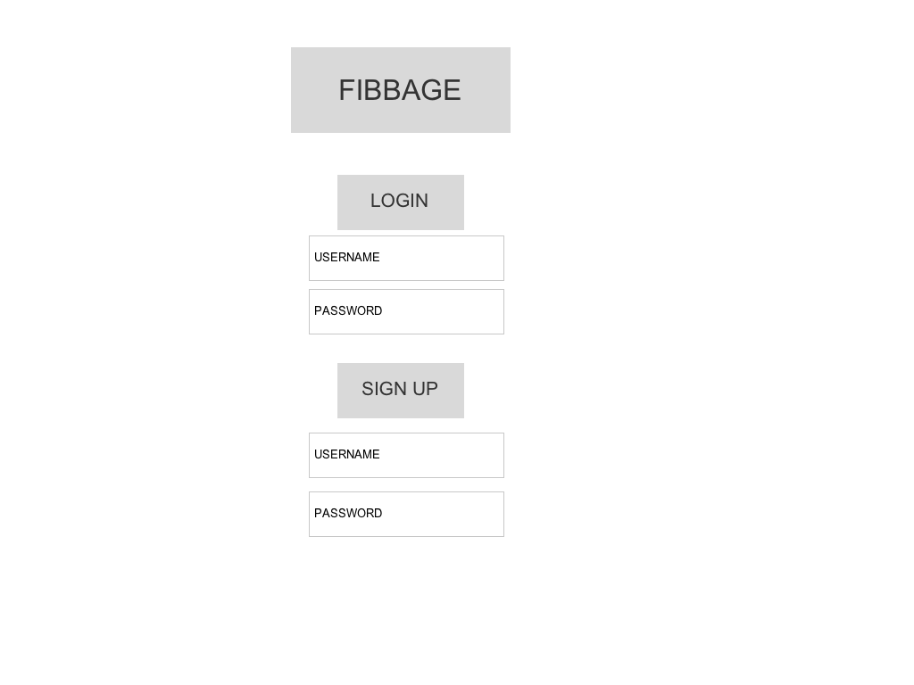
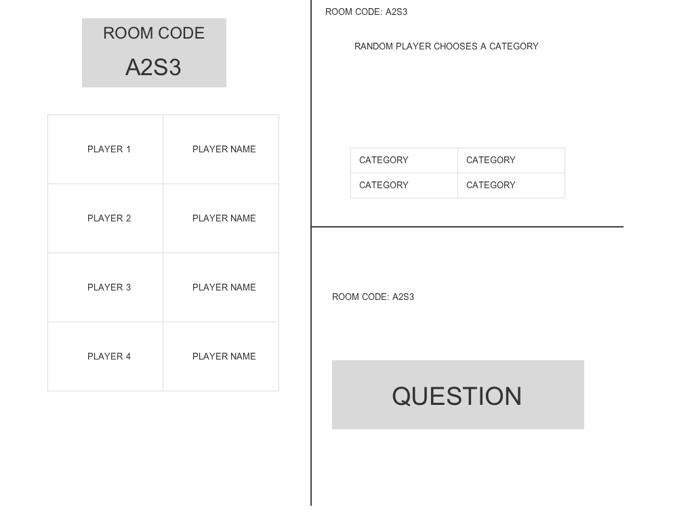
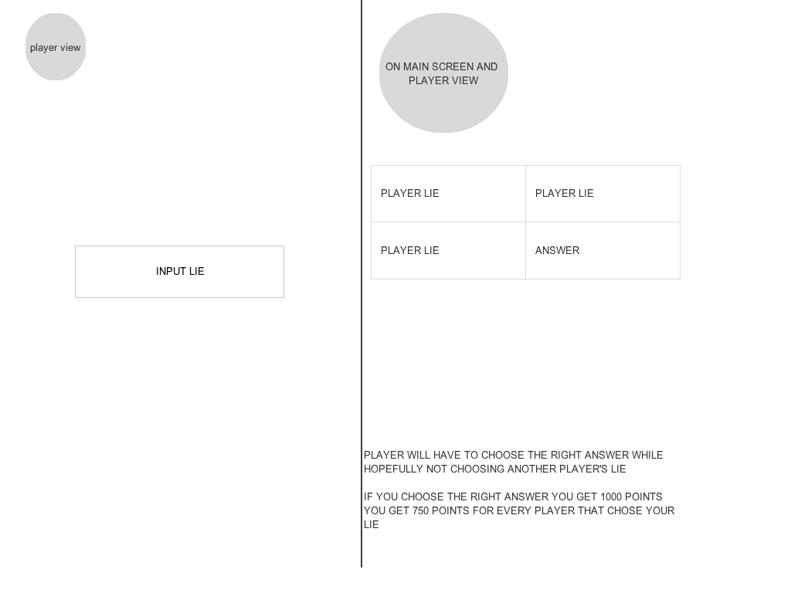
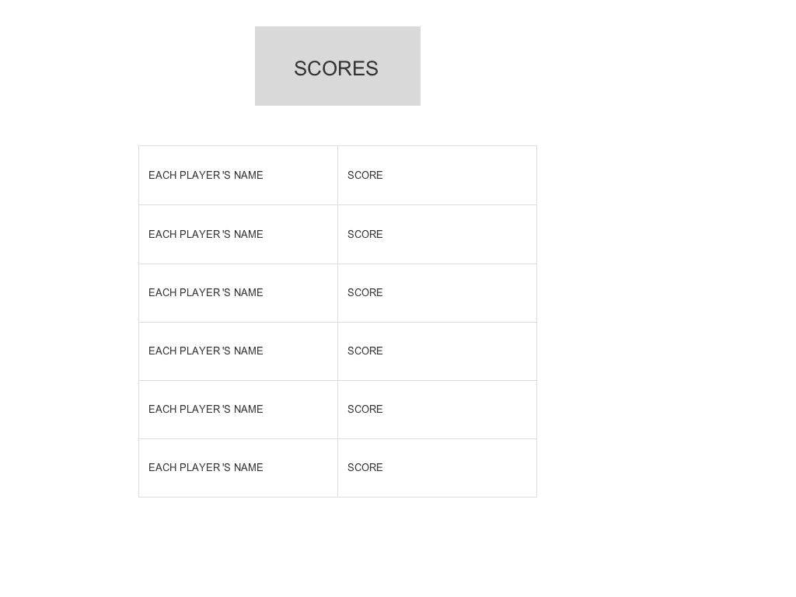
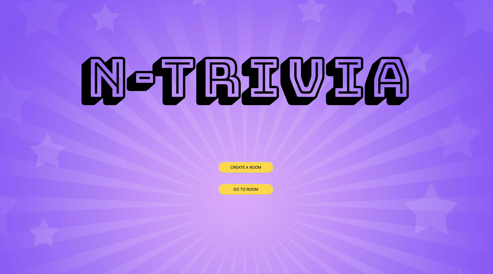
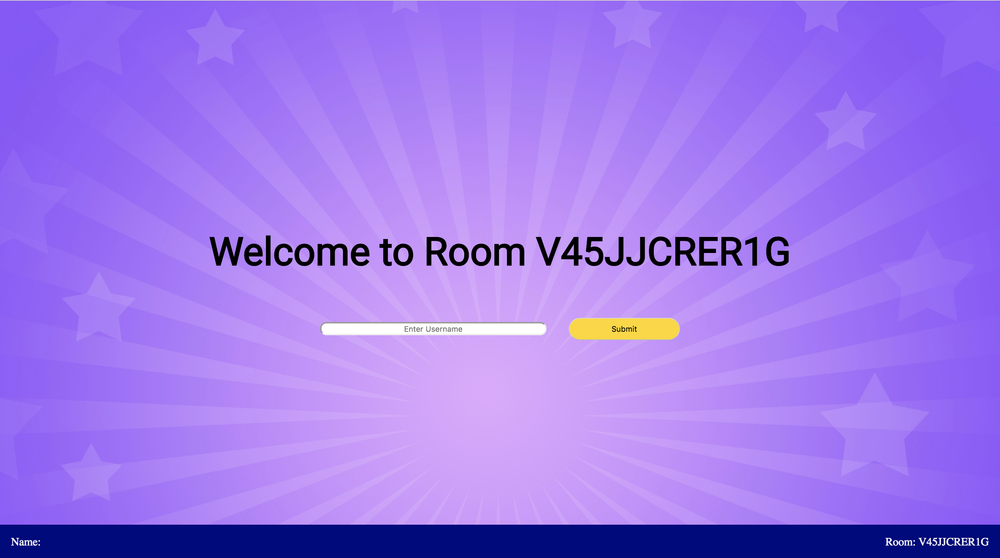
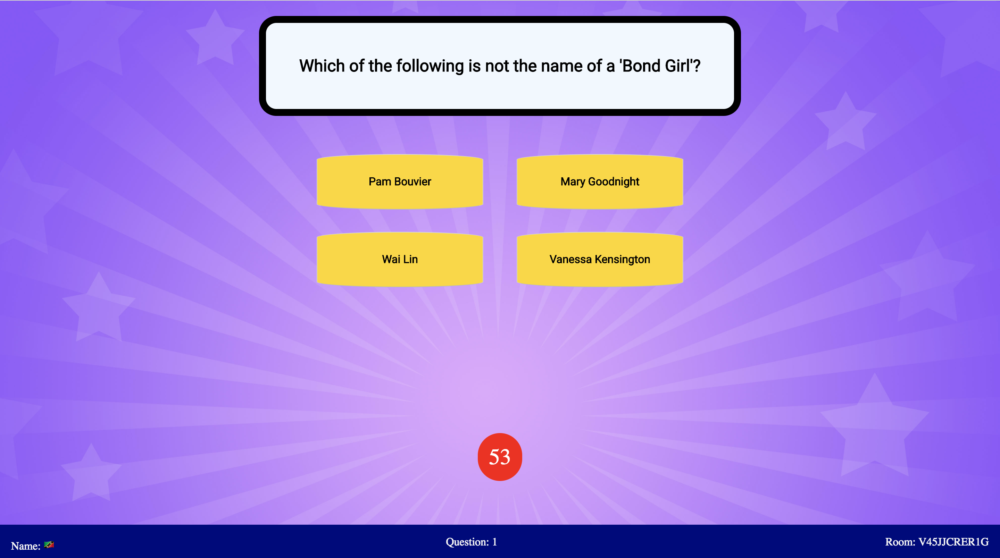
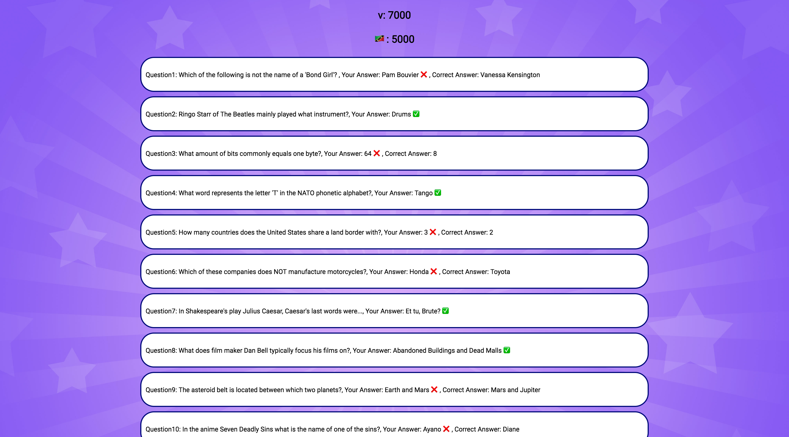
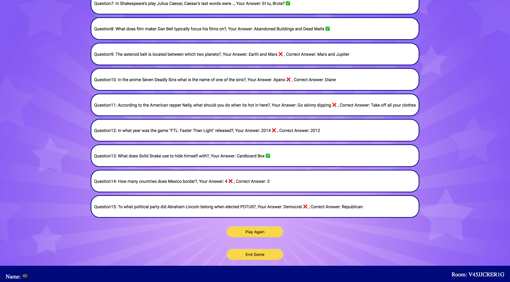

# N-Trivia

Link: https://n-trivia.herokuapp.com/

## Description
N-Trivia is a multiplayer trivia game.  Multiple-choice questions are displayed on the screen and players answer the question using theur computers/laptops tablet or smartphones.

## User Stories
#### Users Can
* Create a room
* Enter a room to play with friends
* Compete with friends to see who scores the most
* See which questions they get right or wrong
* Learn about new things from the questions asked

## Tech Used
* Socket.io - Connect multiple users to the same server
* React.js - Javascript Library for building user interfaces
* Express - Web Applicatin framework for Node.js
* Node-fetch - Module that bringe fetch to Node.js
* Querystring - Module for parsing and formatting URL query strings
* Open Trivia Db API - API for all the trivia questions

## Approach Taken
The approach I took was to take everything in stride.  If I got stuck on a problem and I couldn't think of a way around it, I would take a walk, see how everyone else is doing, and hopefully the answer would come to me.  If that didn't work I would ask a classmate, then maybe an instructor.

Since Socket.io was something new to me, I took the first couple of days just reading up on it.  If I ever had trouble with it I would read the docs again, or read the cheatsheet. 

## Wireframes
### Landing

### Start Game

### Answer

### Score

## Screenshots
### Landing

### Room Landing

### Question

### Score

## Major Hurdles
* Getting the Questions to emit one by one
* Having an setInterval in a promise that the promise doesn't skip
* Decoding the questions from the API
* Having the learn Socket.io from scratch just from using the docs
* Having Socket.io generate a room with a random ID
* Being able to have multiple rooms with their own namespace

## Things I Would Like To Implements In The Future
* Having a database for the rooms
* Saving the socket.id of each player so I can have them choose a category
* Implementing the lie phase (like in Fibbage)
* Have user Authentication
* Show the player their current score
* 

## Installation Instructions
* Fork and Clone this repo
* Cd into this repo
* npm install all dependencies
* run node/nodemon server.js
* run npm start on another tab of terminal